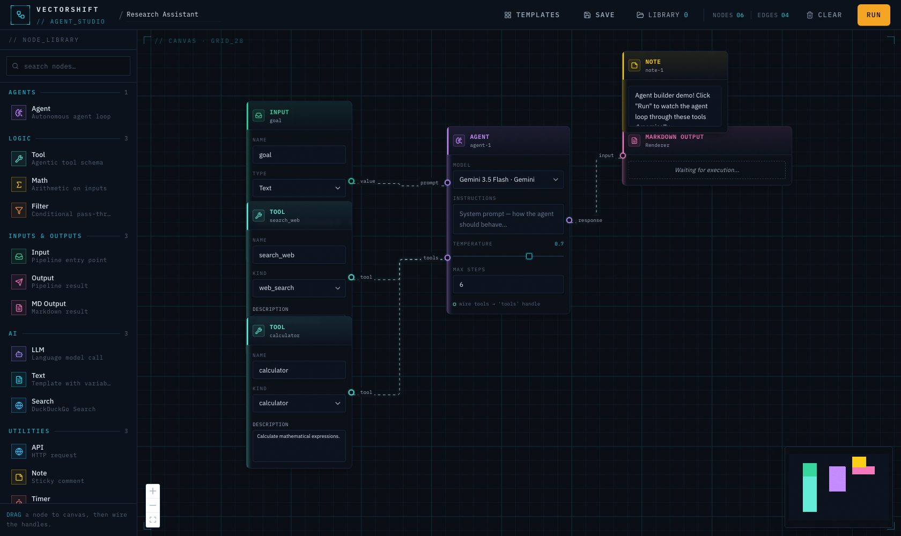
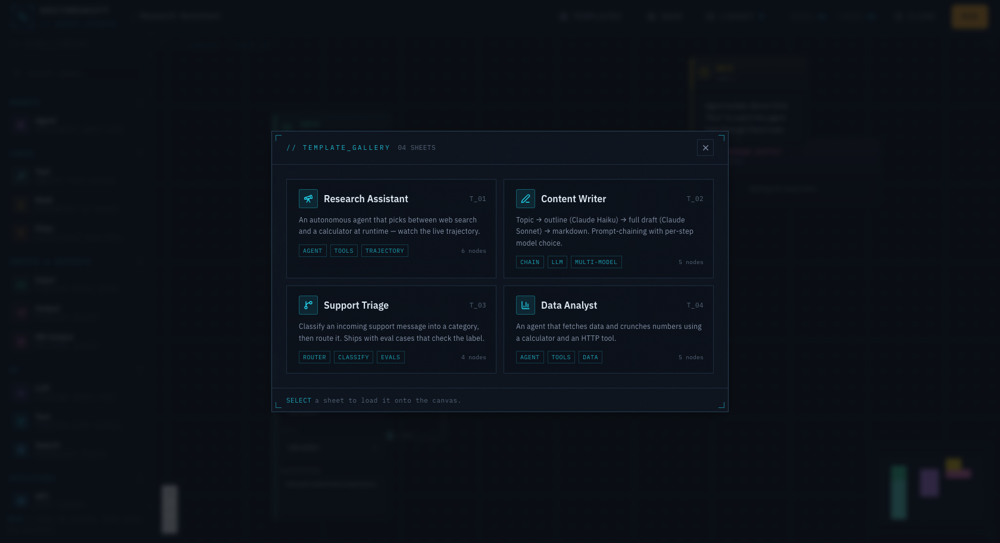
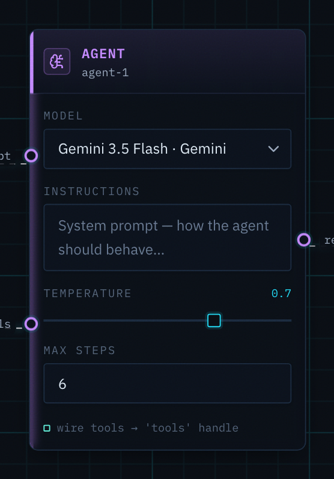

# VectorShift — Agent Studio

A visual builder for **agents**, not just workflows.

Every drag-and-drop builder ships the same primitive: a static, human-wired DAG where *you* decide the path. But the line between a **workflow** and an **agent** is that an agent decides its own path at runtime — it picks which tool to call, loops, and stops when done. A DAG can't represent that. So this app makes the agent a first-class node: you wire it to a set of *available* tools, hit Run, and watch the **live trajectory** it actually chose — different per input — stream onto the canvas with a reasoning timeline.

Built on the VectorShift frontend technical assessment, extended into a usable studio.



---

## What it does

- **Agent node + live trajectory** — an agent runs a real tool-use loop (Gemini / Claude), choosing among connected Tool nodes; the canvas animates the path it took, step by step.
- **Configurable models** — per-node model picker across providers (Gemini real, Claude via the Anthropic SDK, OpenAI optional), plus system instructions, a temperature slider, and a step cap. Each provider degrades to a labeled mock when its key is absent, so demos never flop.
- **Eval harness** — attach test cases (input → assertion) to a pipeline, run them all, and get a pass-rate ring. Eval-driven development, in a visual builder.
- **Save & reuse** — local-first library with canvas autosave and JSON export/import, mirrored to a backend store for cross-device sync.
- **Template gallery** — four ready-made use cases to start from.
- **Live execution** — topological run streamed node-by-node over SSE, with a Trace/Evals **Inspector** (per-step output, latency, token estimate).
- **13 node types** — Agent, Tool, Input, Output, Markdown Output, LLM, Text (`{{variable}}` handles), Web Search, Math, Filter, API, Note, Timer.

### Template gallery


### Per-node model & behavior config


---

## Architecture

```
frontend (React + React Flow + Zustand)        backend (FastAPI)
  nodes/        config-driven nodes (BaseNode)    services/graph.py   topological executor + SSE
  lib/models    provider/model registry  ───────► services/llm.py     call_llm() provider dispatch
  lib/templates starter pipelines                 services/agent.py   tool-use loop (Gemini/Claude)
  lib/storage   localStorage + autosave  ───────► services/eval.py    eval-case runner
  store.js      single Zustand store              services/agent_store.py  saved-agent store
  services/api  fetch + SSE reader       ───────► api/routes/*        /pipelines /agents /files
```

A node is defined once in `lib/nodeCatalog.js`; the canvas and the sidebar palette both derive from it. Models are defined once in `lib/models.js` and mirrored in `app/services/llm.py` — adding a model/provider is a single entry on each side.

**Stack:** React 18, React Flow, Zustand, Tailwind, Framer Motion, sonner, lucide-react, IBM Plex Mono/Sans · FastAPI, Pydantic, SSE, google-generativeai, anthropic, duckduckgo-search.

---

## Run locally

```bash
# backend
cd backend
python -m venv .venv && . .venv/bin/activate
pip install -r requirements.txt
cp .env.example .env        # add GEMINI_API_KEY (and optional ANTHROPIC_API_KEY)
uvicorn app.main:app --reload

# frontend (new terminal)
cd frontend
npm install
npm start                   # http://localhost:3000 → backend on :8000
```

Without keys the LLM/agent nodes return labeled mock responses, so the app is fully explorable offline.

## Deploy

Backend → Render, frontend → Vercel/Netlify. The backend streams SSE, so it must run as a real server (not a serverless function). See **[DEPLOY.md](DEPLOY.md)**.

---

## Design

A deliberate **engineering-blueprint / schematic** aesthetic — deep ink, cyan + amber, IBM Plex Mono, a drafting grid, registration marks, and instrument-style controls — chosen to avoid generic AI-tool look and make the canvas feel like a technical instrument.
